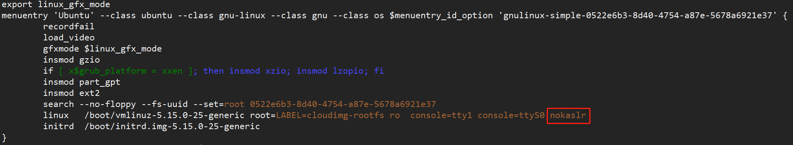
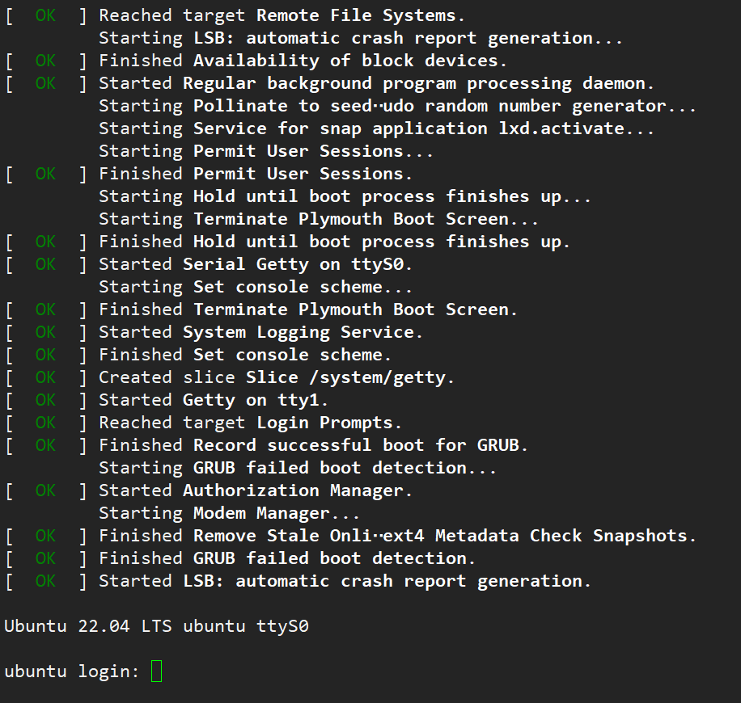
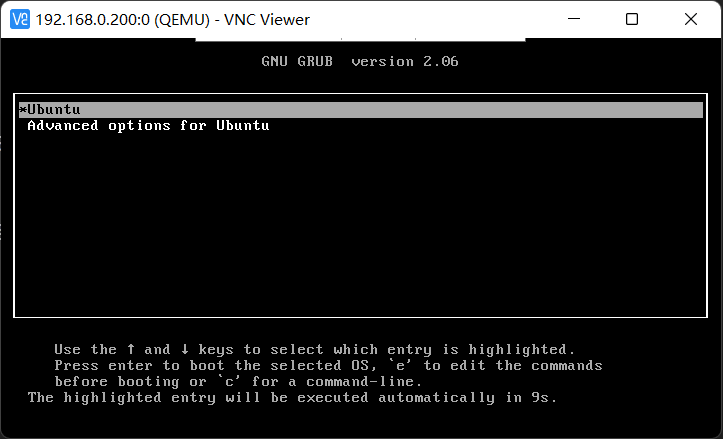
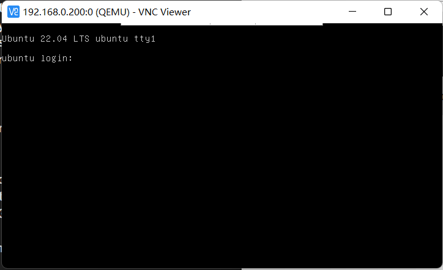
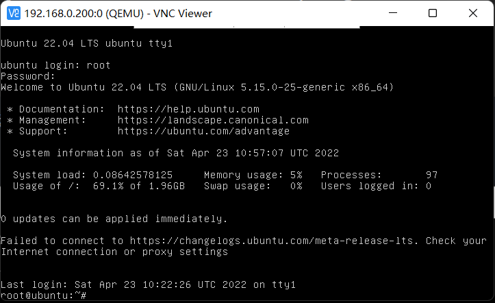
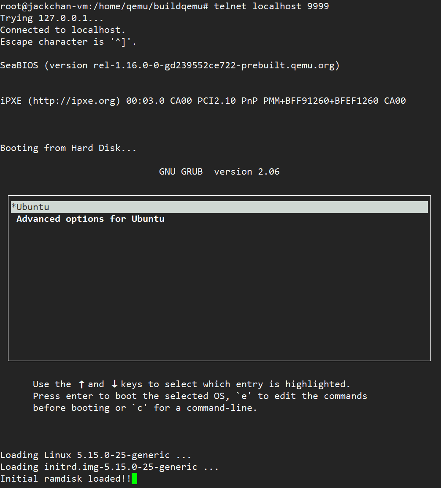
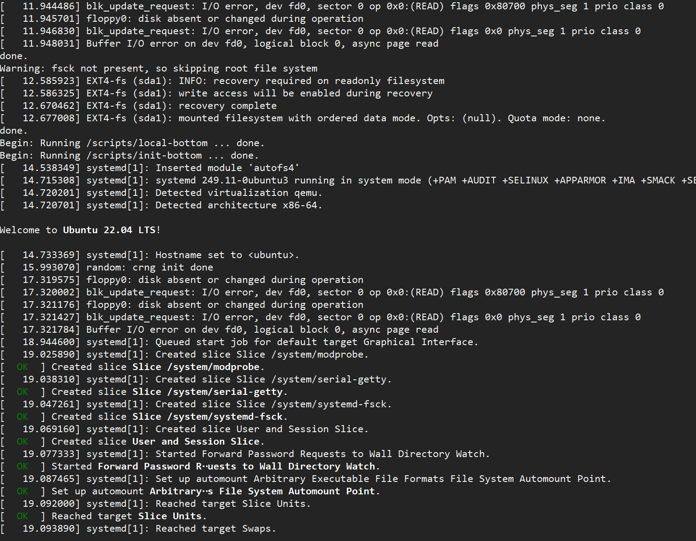
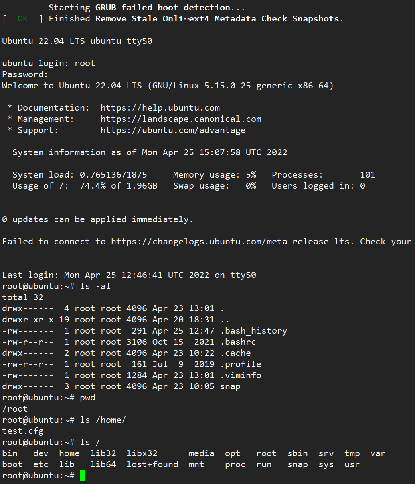

# qemu + gdb 调试 kernel 流程
- [qemu + gdb 调试 kernel 流程](#qemu--gdb-调试-kernel-流程)
  - [环境信息](#环境信息)
  - [安装 qemu](#安装-qemu)
  - [修改云镜像](#修改云镜像)
    - [下载云镜像](#下载云镜像)
    - [挂载云镜像](#挂载云镜像)
    - [修改 root 密码](#修改-root-密码)
    - [显示 grub 菜单](#显示-grub-菜单)
    - [关闭内核地址随机化](#关闭内核地址随机化)
    - [添加网络配置文件](#添加网络配置文件)
    - [卸载云镜像](#卸载云镜像)
    - [测试云镜像](#测试云镜像)
  - [获取 vmlinux](#获取-vmlinux)
  - [获取内核源码](#获取内核源码)
  - [调测内核](#调测内核)
    - [启动 qemu](#启动-qemu)
    - [连接串口](#连接串口)
    - [启动 gdb](#启动-gdb)
  - [配置网络](#配置网络)
    - [添加桥接网口](#添加桥接网口)
    - [添加网络设备](#添加网络设备)
    - [查看网络状态](#查看网络状态)
  - [启动 ssh](#启动-ssh)
    - [生成 ssh key](#生成-ssh-key)
    - [修改 sshd 配置文件](#修改-sshd-配置文件)
  - [指定 kernel 和 initrd 方式启动](#指定-kernel-和-initrd-方式启动)
    - [编译 busybox](#编译-busybox)
    - [下载云镜像](#下载云镜像-1)
    - [挂载云镜像](#挂载云镜像-1)
    - [安装 rootfs](#安装-rootfs)
    - [添加 busybox 相关文件](#添加-busybox-相关文件)
    - [添加网卡驱动](#添加网卡驱动)
    - [修改 root 密码及生成 ssh key](#修改-root-密码及生成-ssh-key)
    - [生成 initrd](#生成-initrd)
    - [启动 qemu](#启动-qemu-1)
  - [参考文献](#参考文献)

## 环境信息

- OS：Ubuntu 22.04 LTS
- qemu：qemu 7.0.0（源码编译安装）
- gdb：gdb 12.0.90（ubuntu 22.04 lts 自带）
- gcc：gcc 11.2.0（ubuntu 22.04 lts 自带）

## 安装 qemu

源码编译安装：

```bash
# 下载 qemu 源码包
wget https://download.qemu.org/qemu-7.0.0.tar.xz

tar Jxf qemu-7.0.0.tar.xz
mkdir qemubuild
cd qemubuild

# 安装必须的软件包
apt install ninja-build meson pkg-config libglib2.0-dev libpixman-1-dev gdb gcc -y

# 根据需要使能架构，默认使能所有架构
../qemu-7.0.0/configure --target-list=aarch64-softmmu,riscv64-softmmu,x86_64-softmmu,arm-softmmu,i386-softmmu
make -j16
make install

# 也可以直接将构建目录加到 PATH 环境变量里，则不需要 make install
# 在 /root/.bashrc 中添加
export PATH=/xxx/qemu-build/:$PATH

# 其他可选安装包（非必须）
apt install libsdl2-dev libsdl1.2-dev
apt install libcap-dev libcap-ng-dev libcurl4-gnutls-dev libgtk-3-dev
apt install libaio-dev libbrlapi-dev libbz2-dev
apt install libibverbs-dev libjpeg8-dev libncurses5-dev libnuma-dev
apt install librbd-dev
apt install libsasl2-dev libseccomp-dev libsnappy-dev libssh2-1-dev libssh-dev
apt install libvde-dev libvdeplug-dev libvte-2.91-dev
apt install valgrind xfslibs-dev
apt install libnfs-dev libiscsi-dev
apt install liburing-dev
apt install libxml2-dev
```

*注意：*

*1、qemu 提供的 target 中每种架构都有两种模式 xxx-softmmu 和 xxx-linux-user，其区别可参考 https://www.cnblogs.com/pengdonglin137/p/5020143.html*

*2、也可以使用 ubuntu、centos 等 OS 发行版自带的 qemu，可参考  https://blog.csdn.net/Anhui_Chen/article/details/112064830*

*3、如果需要 qemu 支持图形窗口，还需要安装 sdl，gtk，ncurses 相关的的图形库开发包（安装其中之一即可）。安装后，configure 输出里可以看到  SDL，GTK， curses  support 为  YES，可参考 https://wiki.qemu.org/Hosts/Linux*

## 修改云镜像

### 下载云镜像

大部分 OS 厂商会发布 img，qcow2 等格式的虚拟机镜像文件（已安装好系统）。

ubuntu 22.04 lts 云镜像地址：http://cloud-images.ubuntu.com/jammy/current/jammy-server-cloudimg-amd64.img

```bash
# 下载云镜像
wget http://cloud-images.ubuntu.com/jammy/current/jammy-server-cloudimg-amd64.img
```

### 挂载云镜像
```bash
# 连接云镜像
modprobe nbd
qemu-nbd -c /dev/nbd1 jammy-server-cloudimg-amd64.img
# 执行上述命令后，/dev 目录下可以看到名字为 nbd1p* 的块设备，对应云镜像内部分区
# 本人环境为 nbdp1(根分区)、nbdp14(BIOS boot 保留分区)、nbdp15(EFI 分区)
mkdir debugrootfs
mount /dev/nbd1p1 debugrootfs
```

*注意：libguestfs-tools 也可以实现对 qcow2 的解析挂载。*

### 修改 root 密码

```bash
# 修改密码后 exit 退出 chroot 环境
chroot debugrootfs bash --login
passwd root
```

### 显示 grub 菜单

默认情况下，ubuntu 启动过程中不显示 grub 菜单。需要修改 `debugrootfs/boot/grub/grub.cfg` ，如下：

```bash
diff --git a/grub.cfg b/grub.cfg
index 2727e68..c8dc747 100644
--- a/grub.cfg
+++ b/grub.cfg
@@ -84,15 +84,17 @@ function load_video {
 terminal_input console
 terminal_output console
 if [ "${recordfail}" = 1 ] ; then
-  set timeout=0
+  set timeout_style=menu
+  set timeout=10
 else
   if [ x$feature_timeout_style = xy ] ; then
-    set timeout_style=hidden
-    set timeout=0
+    set timeout_style=menu
+    set timeout=10
   # Fallback hidden-timeout code in case the timeout_style feature is
   # unavailable.
   elif sleep --interruptible 0 ; then
-    set timeout=0
+    set timeout_style=menu
+    set timeout=10
   fi
 fi
 ### END /etc/grub.d/00_header ###
-- 
2.34.1

```

### 关闭内核地址随机化

内核启动参数添加 nokaslr，关闭内核地址随机化（随机化会导致 gdb 断点不生效）。需要修改 `debugrootfs/boot/grub/grub.cfg` ，如下：

<div align="center">

</div>

### 添加网络配置文件

在 `debugrootfs/etc/systemd/network/` 目录下添加文件，`ens3.network`，内容如下：

```bash
# debugrootfs/etc/systemd/network/ens3.network
[Match]
Name=ens3

[Network]
Address=192.168.0.209/24
Gateway=192.168.0.1
DNS=192.168.0.1
```

*注意：下载的云镜像通过 systemd-networkd 服务管理网络，`ens3.network` 为网口配置文件。其中，ens3 为 qemu 虚拟机内部网口名。也可以启动以后在虚拟机内部添加 。可参考：https://wiki.archlinux.org/title/Systemd-networkd_(%E7%AE%80%E4%BD%93%E4%B8%AD%E6%96%87)*

### 卸载云镜像

```bash
# 卸载断开云镜像
umount debugrootfs
qemu-nbd -d /dev/nbd1
```

### 测试云镜像

```bash
qemu-system-x86_64 -m 4096 -smp 2 jammy-server-cloudimg-amd64.img -vnc :0 -serial stdio
# -m		内存，单位为 MB
# -smp		cpu 核数
# -vnc		指定 vnc 端口号，可以通过 vnc 工具连接
# -serial	指定串口，这里重定向到标准IO
```

正常情况下，屏幕可以看到内核日志以及启动日志，最终输出登录提示：

<div align="center">

</div>

通过 VNC Viewer 连接（输入 `host_ip:port`，`host_ip` 为运行 qemu 命令的主机 ip，`port` 为 qemu 命令 `-vnc` 指定的参数）。连接可以看到 grub 界面、内核日志，最终停留在登录界面，输入账户密码后可以正常进入系统。

vnc viewer 工具：https://downloads.realvnc.com/download/file/viewer.files/VNC-Viewer-6.22.315-Windows.exe

<div align="center">

</div>

<div align="center">

</div>

<div align="center">

</div>

*注意：使用指定 kernel + initrd 方式启动速度更快，可以参考 https://blog.csdn.net/Anhui_Chen/article/details/112064830*

## 获取 vmlinux

vmlinux 带有内核调试信息，其版本要与云镜像内部的内核版本一致（需要时一起编译出来的）。通过配置 debug 安装源的方式安装很慢，可以直接使用下载工具下载，然后解压获取。

http://ddebs.ubuntu.com/pool/main/l/linux/linux-image-unsigned-5.15.0-25-generic-dbgsym_5.15.0-25.25_amd64.ddeb

```bash
# 解压 ddeb 包
dpkg -X linux-image-unsigned-5.15.0-25-generic-dbgsym_5.15.0-25.25_amd64.ddeb .
```

解压后，vmlinux 路径为 `./usr/lib/debug/boot/vmlinux-5.15.0-25-generic`。

*注意：如果想通过 apt install 方式安装，可以参考 https://cloud.tencent.com/developer/article/1637887*

## 获取内核源码

```bash
apt install linux-source-5.15.0
```

安装源码包后，源码路径为 `/usr/src/linux-source-5.15.0/linux-source-5.15.0.tar.bz2`，解压获取内核源码。

## 调测内核

### 启动 qemu

命令如下：

```bash
qemu-system-x86_64 -m 4096 -smp 2 jammy-server-cloudimg-amd64.img -vnc :0 -serial telnet:0.0.0.0:9999,server=on,wait=off -nographic -S -s
```

- `-nographic`  

  qemu 默认有图形输出。如果编译 qemu 时有图形库，在 ubuntu 图形终端启动 qemu 后，会自动弹出一个图形窗口（包含客户端图形界面、客户端控制台和 QEMU 监视器三个界面）。在 ssh 端启动 qemu 看不到任何输出（串口和 vnc 可以看到部分输出）。qemu 启动到内核初始化串口完成这段时间的打印（包括 bios 日志、grub 界面、grub 日志等），串口看不到日志（vnc 可以看到）。加了 -nographic 后，则 qemu 没有图形输出，日志会重定向到串口和 vnc（另外，内核启动参数需要添加 console=ttyS0）。

- `-S` 启动时暂停 CPU。
- `-s` 等同于 `-gdb tcp:1234`，启动 gdbserver 并监听 1234 端口。
- `-serial` 重定向串口，具体如下：

```bash
-serial file:/tmp/serial.log # 输出到文件 serial.log
-serial stdio # 输出到当前 session 的标准输入输出
-serial telnet:0.0.0.0:9999,server=on,wait=off # 通过 telnet localhost 9999 连接
-serial /dev/pts/x # 输出重定向到伪终端，x 为伪终端号，ssh 连接后会生成一个伪终端
```

*注意：qemu 命令行参数可以参考：https://www.qemu.org/docs/master/system/invocation.html*

上述命令执行后，会进入 qemu 监视器，可以查看虚拟机内存，寄存器，设备等信息。通过 `info registers` 可以看到 0 核段寄存器和 IP 寄存器 `CS:RIP` 值为 `f000:0000fff0`，即 `0xffff0`。这里保存的是一条跳转指令 `ljmpw    $0xf000:$0xe05b`，目的地址是 `0xfe05b`，这里保存了 bios 程序的第一条指令。关于计算机启动可以参考 https://www.cnblogs.com/flashsun/p/13942138.html

```bash
(qemu) info registers
EAX=00000000 EBX=00000000 ECX=00000000 EDX=00060fb1
ESI=00000000 EDI=00000000 EBP=00000000 ESP=00000000
EIP=0000fff0 EFL=00000002 [-------] CPL=0 II=0 A20=1 SMM=0 HLT=0
ES =0000 00000000 0000ffff 00009300
CS =f000 ffff0000 0000ffff 00009b00
SS =0000 00000000 0000ffff 00009300
DS =0000 00000000 0000ffff 00009300
FS =0000 00000000 0000ffff 00009300
GS =0000 00000000 0000ffff 00009300
LDT=0000 00000000 0000ffff 00008200
TR =0000 00000000 0000ffff 00008b00
GDT=     00000000 0000ffff
IDT=     00000000 0000ffff
CR0=60000010 CR2=00000000 CR3=00000000 CR4=00000000
DR0=0000000000000000 DR1=0000000000000000 DR2=0000000000000000 DR3=0000000000000000 
DR6=00000000ffff0ff0 DR7=0000000000000400
EFER=0000000000000000
FCW=037f FSW=0000 [ST=0] FTW=00 MXCSR=00001f80
FPR0=0000000000000000 0000 FPR1=0000000000000000 0000
FPR2=0000000000000000 0000 FPR3=0000000000000000 0000
FPR4=0000000000000000 0000 FPR5=0000000000000000 0000
FPR6=0000000000000000 0000 FPR7=0000000000000000 0000
XMM00=0000000000000000 0000000000000000 XMM01=0000000000000000 0000000000000000
XMM02=0000000000000000 0000000000000000 XMM03=0000000000000000 0000000000000000
XMM04=0000000000000000 0000000000000000 XMM05=0000000000000000 0000000000000000
XMM06=0000000000000000 0000000000000000 XMM07=0000000000000000 0000000000000000
(qemu) 
(qemu) x /i 0xffff0
0x000ffff0:  ea 5b e0 00 f0           ljmpw    $0xf000:$0xe05b
(qemu) 
(qemu) x /i 0xfe05b
0x000fe05b:  2e 66 83 3e c8 61 00     cmpl     $0, %cs:0x61c8
```

### 连接串口

重新连接一个 ssh，执行命令 `telnet localhost 9999`（`ctrl + ]` 退出连接），回显如下：

```bash
root@jackchan-vm:/home/qemu/buildqemu# telnet localhost 9999
Trying 127.0.0.1...
Connected to localhost.
Escape character is '^]'.
```

因为 CPU 停住，这里没有输出，gdb 连接并 continue 以后，可以看到 bios 日志、grub 界面、grub 日志以及内核日志，同时可以登录系统。VNC 工具连接后也可以看到 bios 日志、grub 界面、grub 日志以及内核日志，并登录系统。

<div align="center">

</div>

### 启动 gdb

重新连接一个 ssh，执行命令 `gdb ./vmlinux-5.15.0-25-generic ` 启动 gdb ，这时查看源码会报错，提示找不到文件。

```bash
(gdb) l start_kernel
929	/build/linux-9H675w/linux-5.15.0/init/main.c: No such file or directory.
```

需要创建目录 `/build/linux-9H675w/`，在目录下创建软连接 `linux-5.15.0` 指向内核源码路径（vmlinux 建议放在内核源码根目录下）。

```bash
mkdir -p /build/linux-9H675w/
cd /build/linux-9H675w/
ln -sf /home/debugkernel/linux-source-5.15.0/ linux-5.15.0
cd linux-5.15.0
gdb ./vmlinux-5.15.0-25-generic
```

在 gdb 命令行中输入 `target remote :1234`，回车后显示如下：

```bash
(gdb) target remote :1234
Remote debugging using :1234
0x000000000000fff0 in exception_stacks ()
(gdb) bt
#0  0x000000000000fff0 in exception_stacks ()
#1  0x0000000000000000 in ?? ()
(gdb)
```

设置断点 `b start_kernel`，然后 `c` 。

```bash
(gdb) b start_kernel
Breakpoint 1 at 0xffffffff832996e5: file /build/linux-9H675w/linux-5.15.0/init/main.c, line 934.
(gdb) c
Continuing.
(gdb) 
Thread 1 hit Breakpoint 1, start_kernel () at /build/linux-9H675w/linux-5.15.0/init/main.c:934
934	{
(gdb) bt
#0  start_kernel () at /build/linux-9H675w/linux-5.15.0/init/main.c:934
#1  0xffffffff83298619 in x86_64_start_reservations (
    real_mode_data=real_mode_data@entry=0x8b000 <error: Cannot access memory at address 0x8b000>)
    at /build/linux-9H675w/linux-5.15.0/arch/x86/kernel/head64.c:525
#2  0xffffffff832986ff in x86_64_start_kernel (real_mode_data=0x8b000 <error: Cannot access memory at address 0x8b000>)
    at /build/linux-9H675w/linux-5.15.0/arch/x86/kernel/head64.c:506
#3  0xffffffff81000107 in secondary_startup_64 () at /build/linux-9H675w/linux-5.15.0/arch/x86/kernel/head_64.S:283
#4  0x0000000000000000 in ?? ()
(gdb) i r rip
rip            0xffffffff832996e5  0xffffffff832996e5 <start_kernel>
(gdb)
```

gdb 执行 continue 后，telnet 端可以看到内核日志，系统启动日志，最终进入登录界面，登录后，可以执行命令。

<div align="center">

</div>

<div align="center">

</div>

## 配置网络

### 添加桥接网口

在 ubuntu 虚拟机上添加一个桥接网口 bridge0，桥接到物理网口 ens33（不同环境名字可能不同），qemu 虚拟机通过 bridge0 连接网络，这样 qemu 虚拟机内部可以直接访问外网。

qemu 虚拟机桥接到 vmware 虚拟机网口，vmware 虚拟机桥接到 windows 物理网卡。这样的网络结构使得三者在网络中是平行关系，相互之间网络互通，也可以访问外部网络。

配置过程中，网络会断开，在 ubuntu 图形界面操作：

```bash
# 安装桥接网口管理工具 brctl tunctl
apt install bridge-utils uml-utilities -y

# 删除所有连接
nmcli c show | grep -v NAME | awk '{print $1}' | xargs -I {} nmcli c delete {}
# 如果 bridge0 已存在，则删除
nmcli d status | grep bridge0 && nmcli d delete bridge0

# 启动 ens33
ip link set ens33 up

# 创建桥接网口 bridge0
brctl addbr bridge0
# 将 ens33 添加到 bridge0
brctl addif bridge0 ens33
# 将 bridge0 纳入 NetworkManager 管理
nmcli d set bridge0 managed yes

# 拷贝网络配置文件，其内容见下方
cp bridge0-connection.nmconnection bridge0-port1.nmconnection /etc/NetworkManager/system-connections
# 重载 nm 连接
nmcli c reload
# 启动桥接网口
ip link set bridge0 up
```

*注意：也可以通过图形界面工具  nm-connection-editor 添加桥接口添加桥接网口。*

- bridge0-connection.nmconnection 配置文件参考：

```bash
# bridge0-connection.nmconnection
[connection]
id=bridge0-connection
type=bridge
interface-name=bridge0

[bridge]

[ipv4]
address1=192.168.0.200/24,192.168.0.1
dns=192.168.0.1;
method=manual

[ipv6]
addr-gen-mode=stable-privacy
method=auto

[proxy]
```

- bridge0-port1.nmconnection 配置文件参考：

```bash
# bridge0-port1.nmconnection
[connection]
id=bridge0-port1
type=ethernet
interface-name=ens33
master=bridge0
slave-type=bridge

[ethernet]
mac-address=00:0C:29:77:FF:73 # ens33 的 mac 地址

[bridge-port]
```

### 添加网络设备

通过 `-netdev` 添加设备，`-device` 指定驱动类型，设备参数中的 script 由 qemu 调用启动和关闭网络。

```bash
qemu-system-x86_64 -m 4096 -smp 2 jammy-server-cloudimg-amd64.img -vnc :0 -serial telnet:0.0.0.0:9999,server=on,wait=off -S -s -nographic \
	-netdev tap,ifname=tap0,script=/usr/local/etc/qemu-ifup,downscript=/usr/local/etc/qemu-ifdown,id=vnet0 \
	-device driver=virtio-net,netdev=vnet0
```

qemu 启动虚时，会创建 tap0 口，并调用 qemu-ifup，脚本启动 tap0，并将其加入到 bridge0 网桥。qemu 退出时，调用 qemu-ifdown，从 bridge0 网桥移除 tap0，关闭然后删除 tap0。

- qemu-ifup 内容如下：

```bash
#!/bin/bash

switch=bridge0

if [ -n "$1" ];then
	ip link set $1 up
	sleep 0.5s
	brctl addif $switch $1
	exit 0
else
	echo 'Error: no specifed interface.'
	exit 1
fi
```

- qemu-ifdown 内容如下：

```bash
#!/bin/bash

switch=bridge0

if [ -n $1 ];then
        tunctl -d $1
        brctl delif ${switch} $1
        ip link set $1 down
        exit 0
else
        echo "Error: no interface specified"
        exit 1
fi
```

*注意：还可以添加 e1000 类型网卡 `-device e1000,netdev=net0 -netdev user,id=net0,hostfwd=tcp::5555-:22`，可参考 https://www.qemu.org/docs/master/system/invocation.html*

### 查看网络状态

ubuntu 虚拟机上可以看到 bridge0 和 tap0。

```bash
1: lo: <LOOPBACK,UP,LOWER_UP> mtu 65536 qdisc noqueue state UNKNOWN group default qlen 1000
    link/loopback 00:00:00:00:00:00 brd 00:00:00:00:00:00
    inet 127.0.0.1/8 scope host lo
       valid_lft forever preferred_lft forever
    inet6 ::1/128 scope host 
       valid_lft forever preferred_lft forever
2: ens33: <BROADCAST,MULTICAST,UP,LOWER_UP> mtu 1500 qdisc fq_codel master bridge0 state UP group default qlen 1000
    link/ether 00:0c:29:77:ff:73 brd ff:ff:ff:ff:ff:ff
    altname enp2s1
12: bridge0: <BROADCAST,MULTICAST,UP,LOWER_UP> mtu 1500 qdisc noqueue state UP group default qlen 1000
    link/ether 22:4a:ff:d1:1a:80 brd ff:ff:ff:ff:ff:ff
    inet 192.168.0.200/24 brd 192.168.0.255 scope global noprefixroute bridge0
       valid_lft forever preferred_lft forever
    inet6 fe80::66d4:af25:f9fb:7686/64 scope link noprefixroute 
       valid_lft forever preferred_lft forever
13: tap0: <BROADCAST,MULTICAST,UP,LOWER_UP> mtu 1500 qdisc fq_codel master bridge0 state UNKNOWN group default qlen 1000
    link/ether 26:bd:5d:dc:e8:e1 brd ff:ff:ff:ff:ff:ff
    inet6 fe80::24bd:5dff:fedc:e8e1/64 scope link 
       valid_lft forever preferred_lft forever
```

qemu 虚拟机内部可以看到 ens0（可以通过在内核启动参数中添加 `biosdevname=0 net.ifnames=0`，保持网口名为 ethx 形式）：

```bash
1: lo: <LOOPBACK,UP,LOWER_UP> mtu 65536 qdisc noqueue state UNKNOWN group default qlen 1000
    link/loopback 00:00:00:00:00:00 brd 00:00:00:00:00:00
    inet 127.0.0.1/8 scope host lo
       valid_lft forever preferred_lft forever
    inet6 ::1/128 scope host 
       valid_lft forever preferred_lft forever
2: ens3: <BROADCAST,MULTICAST,UP,LOWER_UP> mtu 1500 qdisc fq_codel state UP group default qlen 1000
    link/ether 52:54:00:12:34:56 brd ff:ff:ff:ff:ff:ff
    altname enp0s3
    inet 192.168.0.209/24 brd 192.168.0.255 scope global ens3
       valid_lft forever preferred_lft forever
    inet6 fe80::5054:ff:fe12:3456/64 scope link 
       valid_lft forever preferred_lft forever
```

路由信息如下：

```bash
default via 192.168.0.1 dev ens3 proto static 
192.168.0.0/24 dev ens3 proto kernel scope link src 192.168.0.209
```

可以访问外网：
```bash
PING www.a.shifen.com (36.152.44.96) 56(84) bytes of data.
64 bytes from 36.152.44.96 (36.152.44.96): icmp_seq=1 ttl=54 time=27.4 ms
64 bytes from 36.152.44.96 (36.152.44.96): icmp_seq=2 ttl=54 time=14.8 ms
64 bytes from 36.152.44.96 (36.152.44.96): icmp_seq=3 ttl=54 time=15.7 ms
64 bytes from 36.152.44.96 (36.152.44.96): icmp_seq=4 ttl=54 time=15.2 ms

--- www.a.shifen.com ping statistics ---
4 packets transmitted, 4 received, 0% packet loss, time 3009ms
rtt min/avg/max/mdev = 14.795/18.289/27.423/5.283 ms
```

此时，windows 主机、vmware 虚拟机、qemu 虚拟机三者互通，且可以访问外部网络。

## 启动 ssh

ubuntu 云镜像中默认带了 openssh-server，不过没有 key，sshd 启动失败。

### 生成 ssh key

连接 qemu 虚拟机串口或者 vnc 界面，执行如下命令生成 key：

```
ssh-keygen -q -t ecdsa -f /etc/ssh/ssh_host_ecdsa_key -C '' -N ''
ssh-keygen -q -t ed25519 -f /etc/ssh/ssh_host_ed25519_key -C '' -N ''
ssh-keygen -q -t rsa -f /etc/ssh/ssh_host_rsa_key -C '' -N ''
```

### 修改 sshd 配置文件

`/etc/ssh/sshd_config` 中， `PasswordAuthentication` 修改为 `yes`（允许密码登录）。添加 `PermitRootLogin yes`（允许 root 登录）。

`systemctl restart sshd` 使修改生效。

## 指定 kernel 和 initrd 方式启动

busybox 制作的 initrd 体积小、启动快，基本可以满足内核调试需要。如果有其他额外的需求，比如添加 openssh 等，需要拷贝大量文件，比较麻烦。当前思路是 init 进程使用 busybox，其他工具及库文件使用 OS 发型版的软件包，直接通过 dnf、apt 等工具安装即可。这种方式比直接使用云镜像方式启动速度快。使用 ubuntu 外围包也可以，对 dnf、rpm 包管理工具更熟悉点，所以选用了 openeuler。

### 编译 busybox

busybox 代码：https://busybox.net/downloads/busybox-snapshot.tar.bz2

```bash
apt install libncurses-dev -y # make menuconfig 依赖
mkdir busyboxbuild
tar -jxvf busybox-snapshot.tar.bz2
cd busybox
make O=../busyboxbuild defconfig
cd ../busyboxbuild
make menuconfig
# 'Settings --->' ==> '[*] Build static binary (no shared libs)' ==> '< Yes >'

make
make install
```

### 下载云镜像

openeuler 云镜像：https://repo.openeuler.org/openEuler-22.03-LTS/virtual_machine_img/x86_64/openEuler-22.03-LTS-x86_64.qcow2.xz

```bash
wget https://repo.openeuler.org/openEuler-22.03-LTS/virtual_machine_img/x86_64/openEuler-22.03-LTS-x86_64.qcow2.xz
xz -d openEuler-22.03-LTS-x86_64.qcow2.xz
```

### 挂载云镜像

```bash
# 和挂载 ubuntu 云镜像的方式类似
modprobe nbd
qemu-nbd -c /dev/nbd2 openEuler-22.03-LTS-x86_64.qcow2
# 执行上述命令后，/dev 下可以看到 nbd2p1(boot 分区)、nbd2p2(根分区) 两个块设备
# 在 busyboxbuid 同级目录下创建 debugrootfsoe 和 openeulerrootfs
mkdir debugrootfsoe openeulerrootfs
mount /dev/nbd2p2 debugrootfsoe
mkdir -p debugrootfsoe/home/rootfs
mount --bind openeulerrootfs debugrootfsoe/home/rootfs
```

### 安装 rootfs

```bash
cp dnf.conf debugrootfsoe/home # dnf.conf 内容见下方
touch debugrootfsoe/etc/resolv.conf # 本人环境内容为 nameserver 192.168.0.1，即域名服务器地址
chroot debugrootfsoe bash --login
cd home
# 安装 rpm 包（根据情况）
dnf install bash coreutils gawk iproute kmod net-tools openssh-server rpm vi procps-ng lsscsi iputils findutils passwd haveged sudo --installroot=`pwd`/rootfs -c dnf.conf -y
# 清理安装缓存
dnf clean all --installroot=`pwd`/rootfs -c dnf.conf -y
# 退出 chroot 环境
exit
# 删除 inittab（内容为空，会导致启动卡主）和 system-info.sh（登录时会执行，影响登录速度）
rm -f openeulerrootfs/etc/inittab openeulerrootfs/etc/profile.d/system-info.sh
```

*注意：如果后面需要扩展其他包，可以用相同方式进入 chroot 环境，直接 dnf install（不要破坏 rpm 数据库信息）。*

dnf.conf 配置文件参考：

```bash
[main]
cachedir=/var/cache/yum
debuglevel=1
logfile=/var/log/yum.log
reposdir=/dev/null
retries=20
obsoletes=1
gpgcheck=0
# assumeyes 设置为 1，需要交互时默认 yes
assumeyes=0
keepcache=1
install_weak_deps=0
strict=1

# fedora36 repo 源
[fc36]
name=fc36
baseurl=https://mirror.sjtu.edu.cn/fedora/linux/development/36/Everything/x86_64/os
priority=9
enabled=0

# openeuler repo 源
[openeuler]
name=openeuler
baseurl=https://repo.openeuler.org/openEuler-22.03-LTS/everything/x86_64/
priority=1
enabled=1
```

### 添加 busybox 相关文件

```bash
cp busyboxbuild/_install/bin/busybox openeulerrootfs/usr/bin
cd openeulerrootfs
ln -sf usr/bin/busybox init
touch etc/init.d/rcS  # rcS 内容见下方
chmod 755 etc/init.d/rcS 
touch etc/fstab  # fstab 内容见下方
```

rcS 内容，参考 https://github.com/tinycorelinux/Core-scripts/blob/master/etc/init.d/rcS

```bash
#!/bin/sh
# RC Script for Tiny Core Linux
# (c) Robert Shingledecker 2004-2012

echo "[$(date +'%F %T')] begin to execute rcS ..."
# Mount /proc.
[ -f /proc/cmdline ] || /bin/mount /proc

# Remount rootfs rw.
/bin/mount -o remount,rw /

# Mount system devices from /etc/fstab.
/bin/mount -a

[ -d /dev/pts ] || mkdir -p /dev/pts
mount -o rw,nosuid,noexec,relatime,gid=5,mode=620,ptmxmode=000 -t devpts devpts /dev/pts

echo "[$(date +'%F %T')] loading net drivers ..."
insmod /home/failover.ko
insmod /home/net_failover.ko
insmod /home/virtio_net.ko
ip link set lo up
ip link set eth0 up

ipaddr=""
for it in `cat /proc/cmdline`; do
    if [ -z "${ipaddr}" ]; then
        ipaddr=$(echo $it | grep "ipaddr=" | awk -F'=' '{print $2}')
    else
        break
    fi
done

echo "[$(date +'%F %T')] adding ip and route ..."
if [ ! -z "$ipaddr" ]; then
    ip addr add $ipaddr dev eth0
    route add -net 192.168.0.0/24 eth0
    route add default gw 192.168.0.1 eth0
fi

function start_sshd()
{
    echo "[$(date +'%F %T')] starting haveged ..."
    /usr/sbin/haveged -w 1024 -v 1 --Foreground &
    sleep 3

    echo "[$(date +'%F %T')] starting sshd ..."
    /usr/sbin/sshd -D &
}
start_sshd &

# Start agetty when the following processes are not running.
# NAME                                            TTY
# /sbin/agetty -o -p -- \u --noclear tty1 linux    ?
# /bin/login -p --                                 ?
# login -- root                                    ?
# -bash                                           tty1
function tty1_daemon()
{
    while true; do 
        ps -elf | grep -v grep | grep -q \
		-e "\/sbin\/agetty.*tty1 linux" \
		-e "\/bin\/login.*-p.*--" \
		-e "login -- " \
		-e "tty1.*bash"
        if [ $? -ne 0 ]; then
            /sbin/agetty -o "-p -- \\u" --noclear tty1 linux &
        fi
	sleep 5
    done
}
tty1_daemon &

echo "[$(date +'%F %T')] system started!"
clear
```

fstab 内容：

```bash
sysfs /sys sysfs rw,nosuid,nodev,noexec,relatime 0 0
proc /proc proc rw,nosuid,nodev,noexec,relatime 0 0
udev /dev devtmpfs rw,nosuid,noexec,relatime,mode=755 0 0
```

### 添加网卡驱动

将 ubuntu 环境中的驱动拷贝到 rootfs 中。`modinfo xxx.ko` 可以查看驱动路径。

```bash
cp /lib/modules/5.15.0-25-generic/kernel/net/core/failover.ko openeulerrootfs/home
cp /lib/modules/5.15.0-25-generic/kernel/drivers/net/virtio_net.ko openeulerrootfs/home
cp /lib/modules/5.15.0-25-generic/kernel/drivers/net/net_failover.ko openeulerrootfs/home
```

*注意：如果添加了 e1000 网卡，还需要 e1000 网卡驱动 e1000.ko。*

### 修改 root 密码及生成 ssh key

```bash
cd openeulerrootfs
chroot . bash --login
# 修改密码
passwd root
# 生成 key
ssh-keygen -q -t ecdsa -f /etc/ssh/ssh_host_ecdsa_key -C '' -N ''
ssh-keygen -q -t ed25519 -f /etc/ssh/ssh_host_ed25519_key -C '' -N ''
ssh-keygen -q -t rsa -f /etc/ssh/ssh_host_rsa_key -C '' -N ''
# 退出 chroot 环境
exit
```

### 生成 initrd

```bash
# 在 openeulerrootfs 目录下执行
find . -print0 | cpio --null -ov --format=newc | pigz -9 > ../openeulerrootfs.img
```

### 启动 qemu

```bash
qemu-system-x86_64 -m 4096 -smp 2 \
	-kernel /boot/vmlinuz-5.15.0-25-generic \
	-initrd openeulerrootfs.img \
	-append "console=tty1 console=ttyS0 nokaslr ipaddr=192.168.0.210 " \
	-vnc :0 -serial telnet:0.0.0.0:9999,server=on,wait=on,nodelay=on -nographic \
	-netdev tap,ifname=tap0,script=/usr/local/etc/qemu-ifup,downscript=/usr/local/etc/qemu-ifdown,id=vnet0 \
	-device driver=virtio-net,netdev=vnet0
```

## 参考文献

*1、https://www.cnblogs.com/pengdonglin137/p/5020143.html*

*2、https://blog.csdn.net/Anhui_Chen/article/details/112064830*

*3、https://wiki.qemu.org/Hosts/Linux*

*4、https://wiki.archlinux.org/title/Systemd-networkd_(%E7%AE%80%E4%BD%93%E4%B8%AD%E6%96%87)*

*5、https://cloud.tencent.com/developer/article/1637887*

*6、https://www.qemu.org/docs/master/system/invocation.html*

*7、https://www.cnblogs.com/flashsun/p/13942138.html*

*8、https://github.com/tinycorelinux/Core-scripts*

