# ubuntu 22.04 lts 安装步骤（vmware）

- [ubuntu 22.04 lts 安装步骤（vmware）](#ubuntu-2204-lts-安装步骤vmware)
  - [下载镜像](#下载镜像)
  - [安装步骤](#安装步骤)
    - [创建虚拟机](#创建虚拟机)
    - [安装 ubuntu 22.04 lts](#安装-ubuntu-2204-lts)
  - [配置 ubuntu](#配置-ubuntu)
    - [设置 root 密码](#设置-root-密码)
    - [ssh 配置](#ssh-配置)
    - [配置 pageup 和 pagedown 查看历史命令](#配置-pageup-和-pagedown-查看历史命令)
    - [安装 vmware tools](#安装-vmware-tools)
    - [共享文件夹配置](#共享文件夹配置)

## 下载镜像

镜像名称：ubuntu-22.04-desktop-amd64.iso。

下面列出了官方下载地址以及部分国内镜像站，国内镜像站下载速度会更快一点。

- 官方下载地址

  https://ubuntu.com/download/desktop

- 腾讯镜像站

  https://mirrors.cloud.tencent.com/ubuntu-releases/22.04/

- 阿里镜像站

  https://mirrors.aliyun.com/ubuntu-releases/22.04/

- 华为镜像站

  https://repo.huaweicloud.com/ubuntu-releases/22.04

## 安装步骤

vmware 版本：16.2.3 build-19376536

### 创建虚拟机

文件 >> 新建虚拟机 >> 自定义(高级) >> 硬件兼容性 [Workstation 16.2.x] >> 稍后安装操作系统 >> Linux [Ubuntu 64 位] >> 设置虚拟机名称和位置 >> 配置处理器 >> 配置虚拟机内存 >> 使用桥接网络 >> LSI Logic >> SCSI >> 创建新虚拟磁盘 >> 配置磁盘容量，选择将虚拟磁盘拆分成多个文件 >> 配置磁盘文件 >> 完成。

选择新创建的虚拟机 >> 编辑虚拟机设置 >> 选中 CD/DVD (SATA) >> 使用 ISO 映像文件，浏览选择下载的 iso >> 确定。

### 安装 ubuntu 22.04 lts

开启虚拟机进入 GRUB 界面：选择 Try or Install Ubuntu（点击界面后，光标会被锁定到虚拟机内，Ctrl + Alt 释放）。

<div align="center">
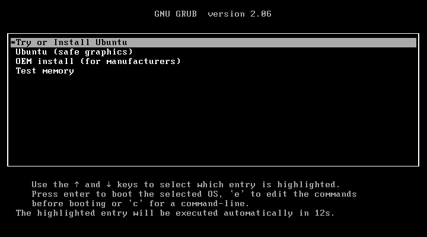
</div>

进入安装界面后，可能窗口很小，显示不完整。可以在虚拟机内，执行 Ctrl + Alt + T，弹出终端窗口后使用命令 `xrandr -s 1280x800` 然后回车。

参考：https://blog.csdn.net/yinjian0924/article/details/123510254

Welcome 界面：左侧选择 English(建议)，右侧选择 Install Ubuntu。

<div align="center">
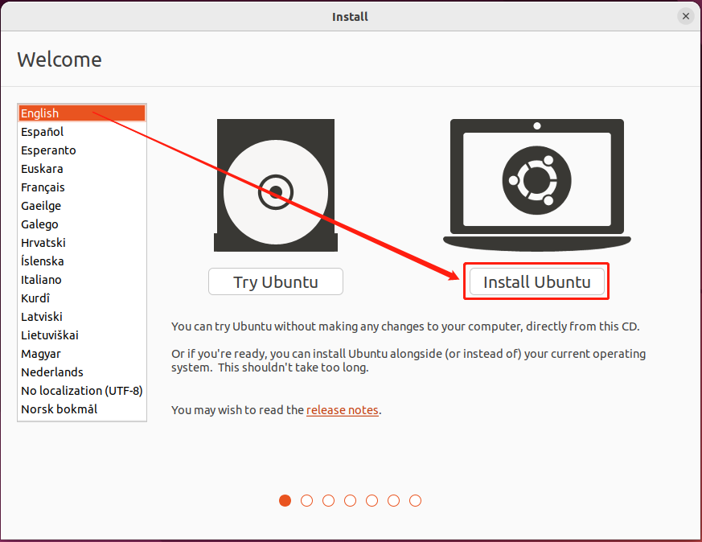
</div>

Keyboard layout 界面：左侧和右侧都选择 English(US)。

<div align="center">
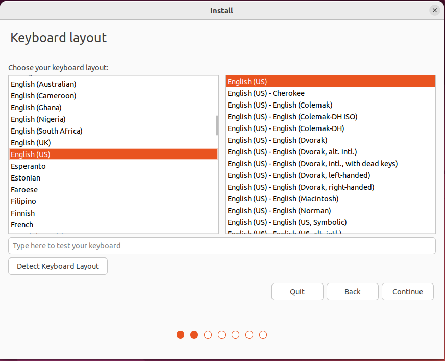
</div>

Updates and other software 界面：选择 Normal installation 和 Downlaod updates while install Ubuntu（也可以不选）。

<div align="center">
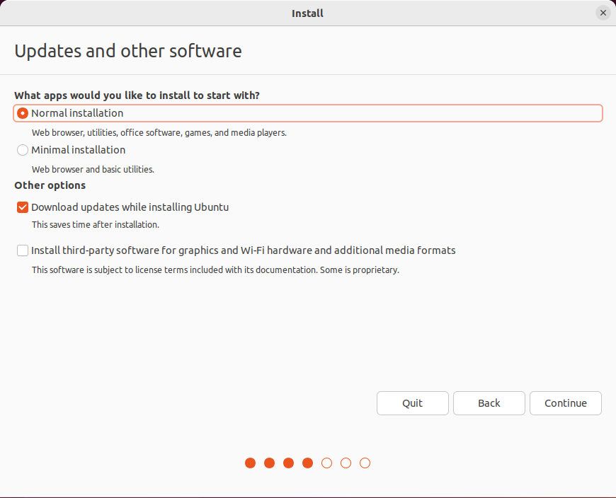
</div>

Installation type 界面：选择 Erase disk and install Ubuntu，则默认分区；选择 Something else，则自定义分区。这里选择 Something else 自定义分区。

<div align="center">
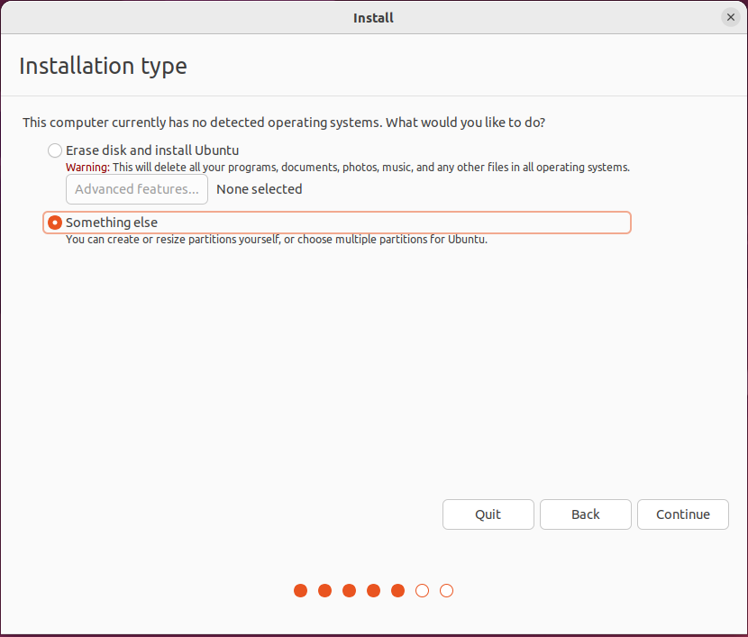
</div>

选中 /dev/sda，然后点击 New Partition Table，弹出的对话框中点击 Continue。

<div align="center">
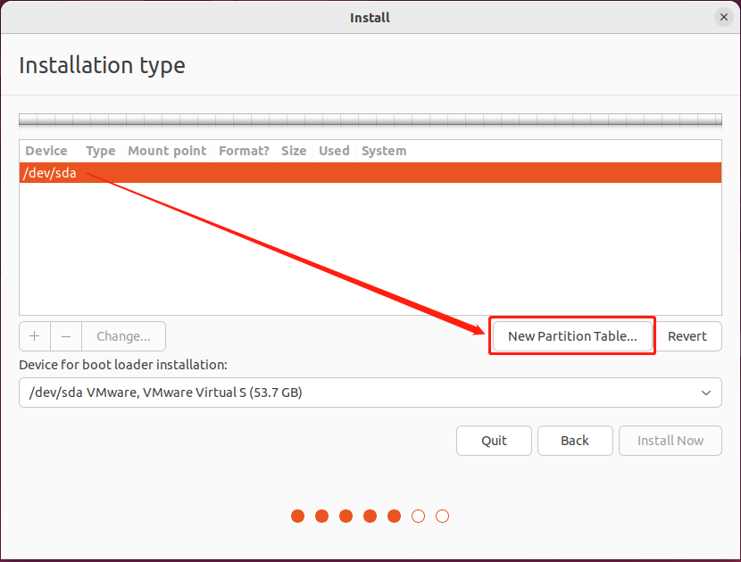
</div>

<div align="center">
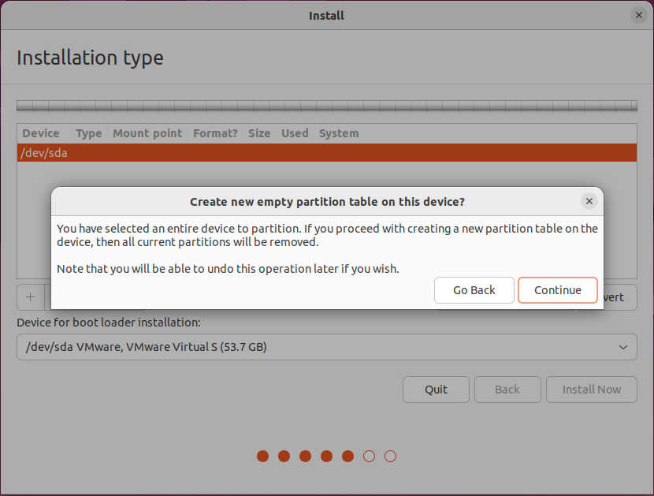
</div>

选中 free space，然后店家左下角加号添加新分区。在弹出的对话框中，Size 设置 5M，Use as 选择 Reserved BIOS boot area，点击 OK 。

其他分区操作类似：

EFI 系统分区：Size 45M，Use as EFI System Partition。

根分区：Size 剩余全部，Use as Ext4 journaling file system，Mount point：/。

<div align="center">
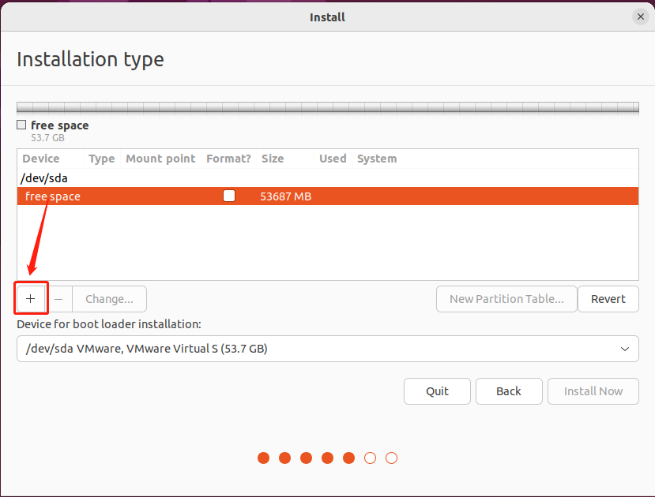
</div>

<div align="center">
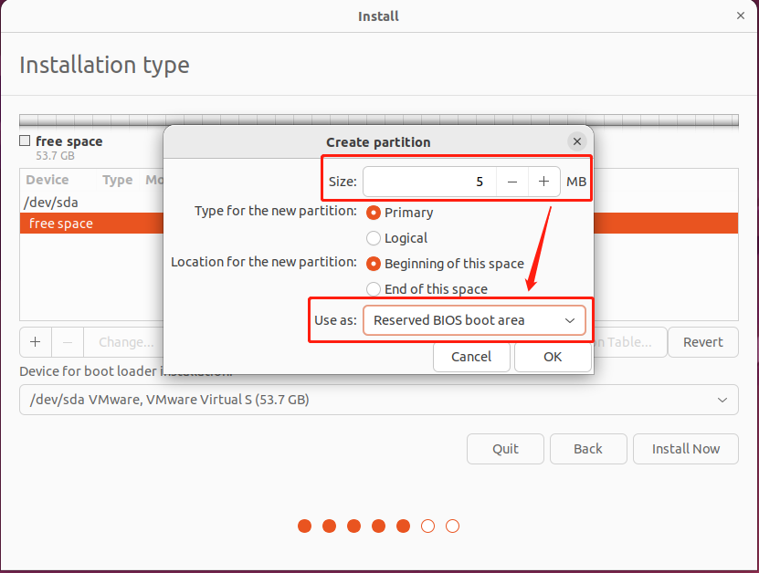
</div>

<div align="center">
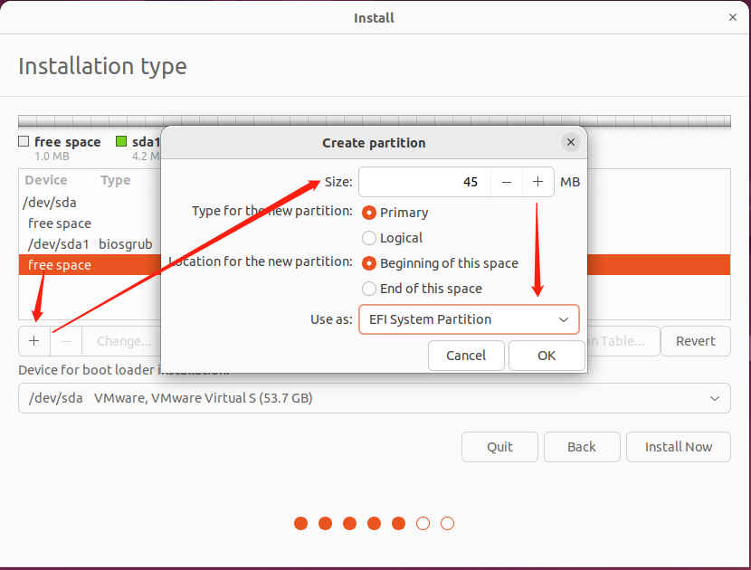
</div>

<div align="center">
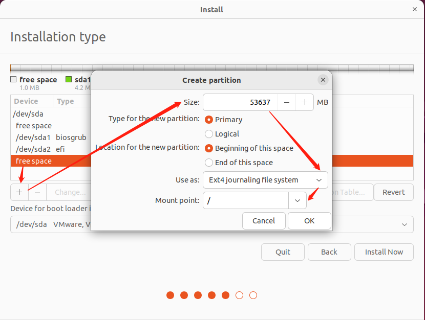
</div>

分区完成后，结构如下，可以根据需要添加其他类型分区。点击 Install Now，弹出的对话框选择 Continue。

<div align="center">
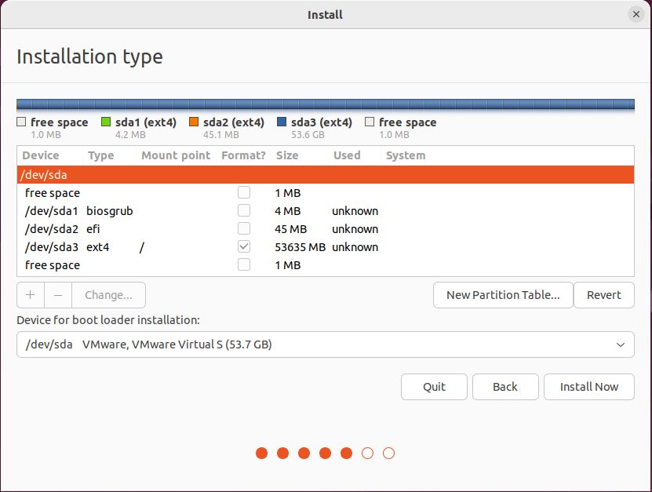
</div>

<div align="center">
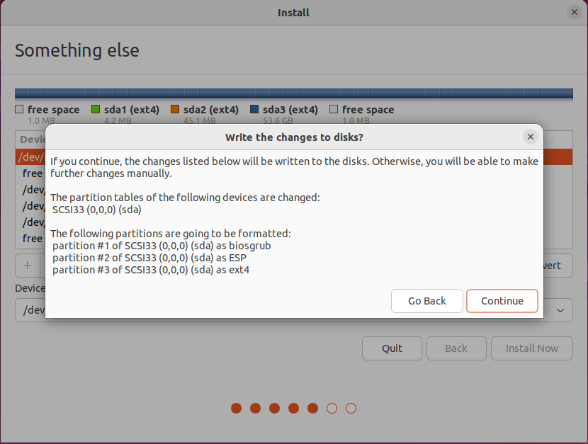
</div>

选择时区，设置用户名、主机名及账户密码，Continue 后，正式开始系统安装。

<div align="center">
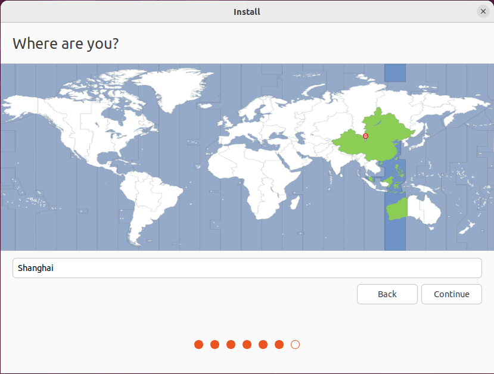
</div>

<div align="center">
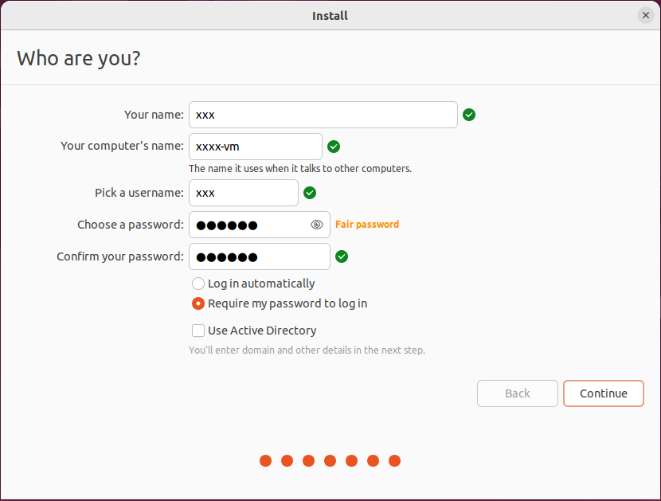
</div>

安装完成后会弹出如下对话框，点击 Restart Now，然后界面提示移除安装介质（即光驱）。

<div align="center">
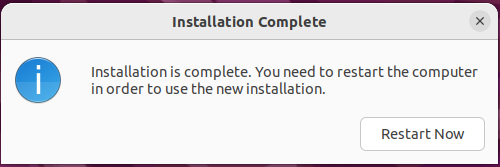
</div>

<div align="center">

</div>

点击菜单栏虚拟机 >> 设置，弹出虚拟设置对话框。左侧选中 CD/DVD（SATA），右侧选择使用物理驱动器，点击确定。

<div align="center">
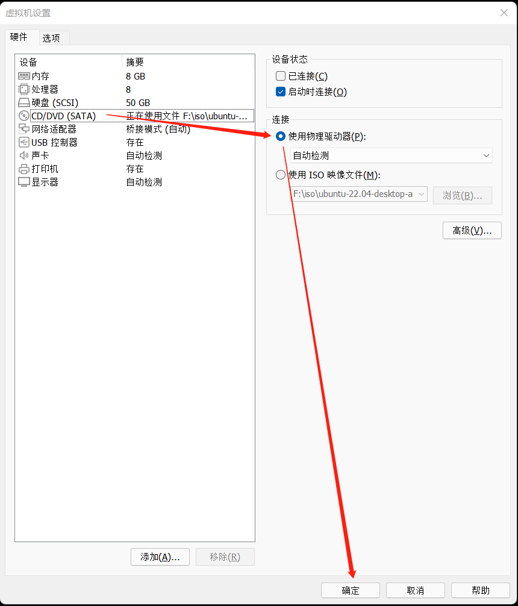
</div>

回到安装界面回车，虚拟机重启。如果虚拟机能正常进入登录界面，说明安装成功。

## 配置 ubuntu

### 设置 root 密码

安装过程中没有找到可以设置 root 密码的地方，普通用户登录后，sudo su 切换到 root，通过 passwd 命令设置 root 密码。

### ssh 配置

ubuntu 默认没有安装 sshd 服务端安装包  openssh-server，需要安装并修改 sshd 配置允许 root 登录。

```bash
sudo apt install vim openssh-server -y
# /etc/ssh/sshd_config 最后一行添加 PermitRootLogin yes
systemctl restart sshd
```

### 配置 pageup 和 pagedown 查看历史命令

取消 /etc/inputrc 中 41 和 42 行注释，然后退出重新登录。配置后可以通过 pageup 和 pagedown 查找历史命令。

```bash
 # /etc/inputrc
 40 # alternate mappings for "page up" and "page down" to search the history
 41 "\e[5~": history-search-backward
 42 "\e[6~": history-search-forward
```

### 安装 vmware tools

点击菜单栏虚拟机 >> 设置，弹出虚拟设置对话框。左侧选中 CD/DVD（SATA），右侧选择使用 ISO 镜像 文件，点击浏览按钮，选择 vmware 根目录下 linux.iso（示例路径为：C:\Program Files (x86)\VMware\VMware Workstation\linux.iso），然后点击确定。

```bash
mkdir /mnt/vmtools
mount /dev/sr0 /mnt/vmtools
# 有时会挂载报错，提示 mount: /mnt: no medium found on /dev/sr0. 可以通过网络将 linux.iso 传入系统中，然后执行如下命令
mount /home/linux.iso /mnt/vmtools

cp /mnt/vmtools/VMwareTools-10.3.23-17030940.tar.gz /home
cd /home
tar -zxvf VMwareTools-10.3.23-16594550.tar.gz
cd vmware-tools-distrib
# INSTALL 为该工具文档，或者直接安装
./vmware-install.pl
```

### 共享文件夹配置

点击菜单栏虚拟机 >> 设置，弹出虚拟设置对话框。点击选项，左侧选中共享文件夹，右侧选中总是启用，然后点击添加。按向导完成添加，最后点击确定即可。添加完成后，在 /mnt/hgfs/ 目录下可以看到共享文件夹。VMware Tools 必须正确安装才能使用共享文件夹。

<div align="center">
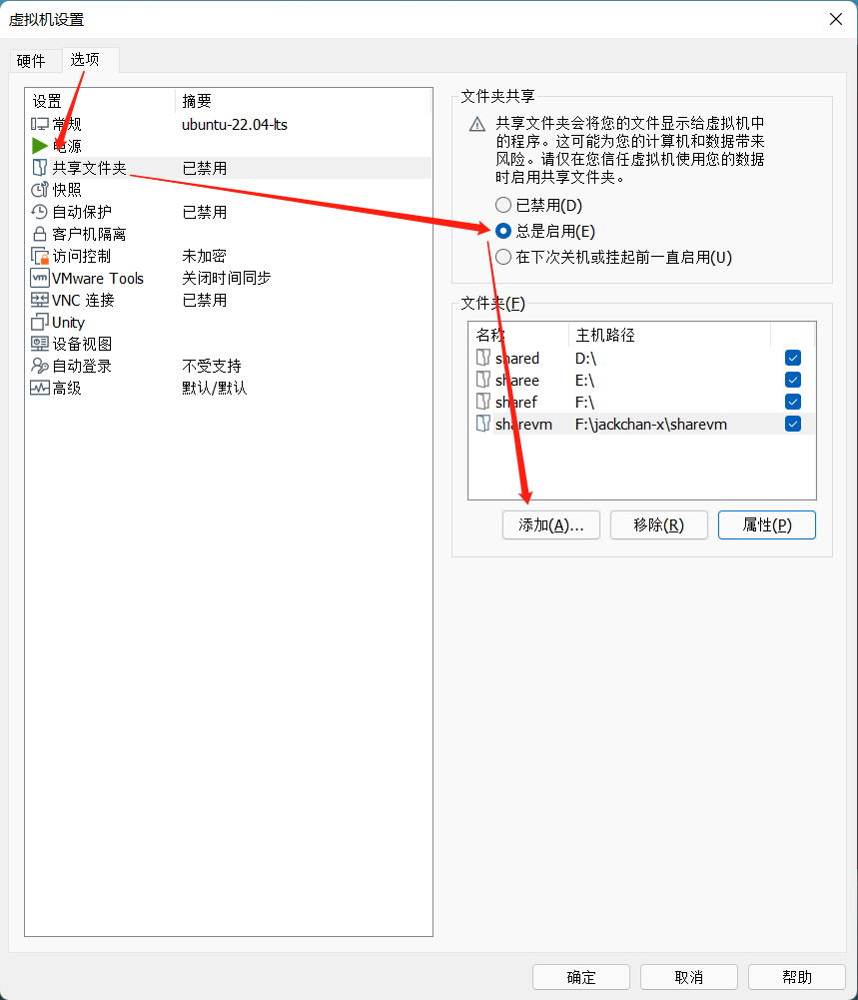
</div>

